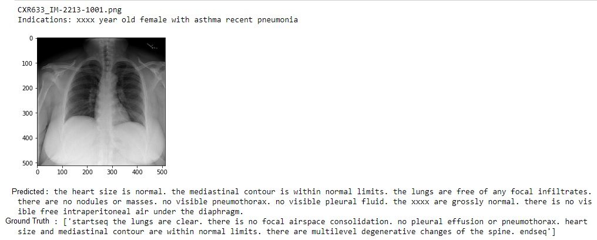

---
Data Science Portfolio
---

# AI based log File Analyser

In this application a NLP Classifier is built by training on several log files which has several issues encountered by the healthcare device. A recomendation system was also developed that is trained with the fixes provided for those issues. In production this application will predict type of error that as arised from the healthcare device and would recommend possible fix that was performed earlier to fix that issue.

# Automated text report generation for Chest Xray.

The Automated Report Generation for Chest Xray Image application generates text reports like the report written by the radiologist for the Chest X ray images. This application is trained on the Chest Xray images and their original reports prepared by radiologist. The application extracts the important features from the X ray images using CNN, and it learns the text report word by word using LSTM. The words in the original report is converted into vectors using word embeddings. A Deep learning model is being created to take X ray images as input and pass it to our trained model. The Model then predicts the report word by word describing the anomalies.

# Multi-Inference Neural Network model that can perform Object detection, depth map and plane surface detection
This application will predict below 3 outputs for a provided single image.
1. Object that are present in the images
2. Depth map of the image
3. Planar surface in the region

An single encoder and multi decoder neural network model is developed and trained on images that have objects annotated, ground truth depth map and planar surface details are provided. One of the decoder model is a Yolo V3 archicture. The decoder that detect dept map is taken from MIDAS network and the decoder that detect plane surface is taken from Planar RCNN.

[Github link](https://github.com/eva5covergence/EVA5_AI_Projects_new/tree/master/Readme/Session15_CapstoneProject)  
[Youtube](https://www.youtube.com/watch?v=W5vej8zcso8)

# CT protocol harmonizer

Performing clustering on Computed tomography protocols and grouping them to form clusters with similar clinical intent. The challenge is to group the customized protocol for which the machine as to learn the clinical intent. A distance-based clustering algorithm will group the customized protocol based on word frequency and similarity methods like Jaccard similarity was used to pick the clinical intent from Radlex play book which is an internationally accepted CT journal.
